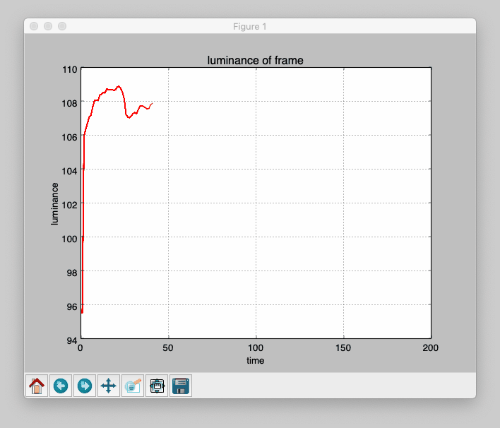

# luminance_average
This is a python code which can show a graph of luminance.

detail
- When the program is run, a Web cammera start taking photos.
- The program calculate average of luminance per frame.
- When 200 of frames were processed, the program is over.
- The frequency of plot depends on speed of process

libraries
- numpy
- opencv(cv2)
- matplotlib

version 1.0

references
- https://note.mu/pomta_trd/n/n15b1d992f5ca
    - about matplotlib
    - structure of a code
- https://ensekitt.hatenablog.com/entry/2017/12/19/200000
    - about OpenCV to take photos from Web camera

